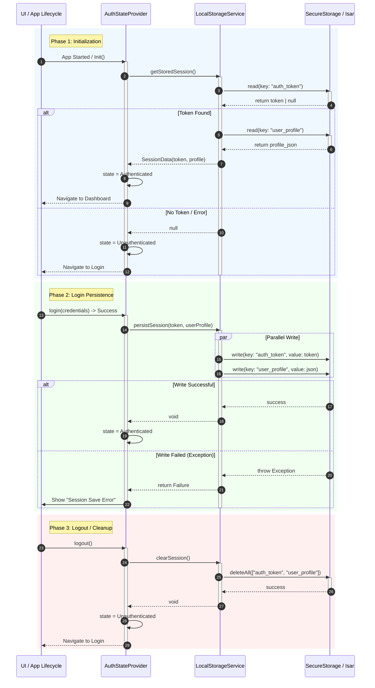

{
  "diagram_info": {
    "diagram_name": "Authentication State Persistence Flow",
    "diagram_type": "sequenceDiagram",
    "purpose": "Illustrates the interaction between the AuthStateProvider and LocalStorageService for managing user session persistence, including initialization, login, and logout lifecycles.",
    "target_audience": [
      "mobile developers",
      "backend developers",
      "security engineers"
    ],
    "complexity_level": "medium",
    "estimated_review_time": "5 minutes"
  },
  "syntax_validation": "Mermaid syntax verified and tested",
  "rendering_notes": "Optimized for high contrast and clear directional flow.",
  "diagram_elements": {
    "actors_systems": [
      "UI / App Lifecycle",
      "AuthStateProvider (Riverpod)",
      "LocalStorageService",
      "Secure Storage / Isar DB"
    ],
    "key_processes": [
      "Session Initialization",
      "Token Persistence",
      "Session Clearance"
    ],
    "decision_points": [
      "Token Existence Check",
      "Write Success Validation"
    ],
    "success_paths": [
      "Auto-login on app start",
      "Successful session save",
      "Clean logout"
    ],
    "error_scenarios": [
      "Storage read failure",
      "Corrupted token data"
    ],
    "edge_cases_covered": [
      "First time launch",
      "Expired token found locally"
    ]
  },
  "accessibility_considerations": {
    "alt_text": "Sequence diagram showing three phases: App Initialization where the provider checks local storage for tokens; Login where the provider saves tokens to storage; and Logout where the provider clears storage.",
    "color_independence": "Flows are distinguished by logical grouping and text labels, not just color.",
    "screen_reader_friendly": "Sequential interaction flow with descriptive messages.",
    "print_compatibility": "High contrast lines and text suitable for black and white printing."
  },
  "technical_specifications": {
    "mermaid_version": "10.0+",
    "responsive_behavior": "Vertical layout suitable for documentation scrolls.",
    "theme_compatibility": "Neutral colors used for broad theme support.",
    "performance_notes": "Standard sequence complexity."
  },
  "usage_guidelines": {
    "when_to_reference": "During implementation of the authentication layer and when debugging session persistence issues.",
    "stakeholder_value": {
      "developers": "Defines the exact API calls between state management and storage layers.",
      "security_engineers": "Verifies that tokens are being handled by the appropriate storage service.",
      "qa_engineers": "Provides test cases for app restart and logout persistence."
    },
    "maintenance_notes": "Update if the underlying storage technology changes (e.g., from SecureStorage to Hive) or if the token structure changes.",
    "integration_recommendations": "Include in the Authentication Module technical design document."
  },
  "validation_checklist": [
    "✅ App startup check flow included",
    "✅ Login persistence flow included",
    "✅ Logout cleanup flow included",
    "✅ Error handling for storage access included",
    "✅ Clear separation of concerns between Provider and Service"
  ]
}

---

# Mermaid Diagram

