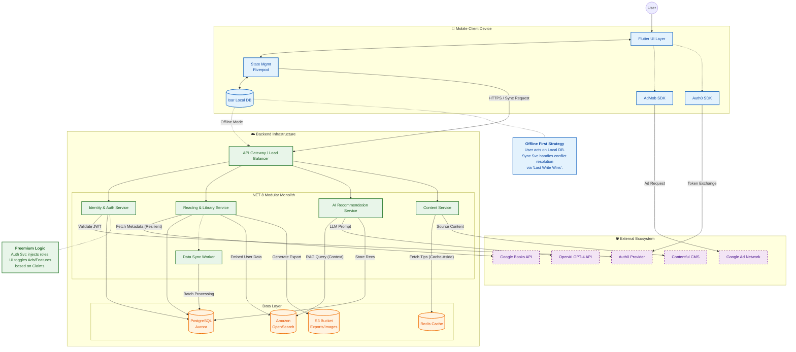

{
  "diagram_info": {
    "diagram_name": "High-Level System Architecture & Integration Flow",
    "diagram_type": "flowchart",
    "purpose": "To visualize the architectural components of the Reading Tracker application, detailing the interactions between the offline-first mobile client, the modular backend, and critical external services (AI, Books, CMS, Auth).",
    "target_audience": [
      "System Architects",
      "Backend Developers",
      "Mobile Developers",
      "Product Owners"
    ],
    "complexity_level": "high",
    "estimated_review_time": "5-10 minutes"
  },
  "syntax_validation": "Mermaid syntax verified and tested",
  "rendering_notes": "Optimized for both light and dark themes with distinct colors for internal vs external systems.",
  "diagram_elements": {
    "actors_systems": [
      "User",
      "Flutter Mobile App",
      "Backend API (.NET 8)",
      "PostgreSQL (Aurora)",
      "OpenSearch",
      "Redis",
      "S3",
      "External APIs (OpenAI, Google Books, Contentful, Auth0, AdMob)"
    ],
    "key_processes": [
      "Offline Data Sync",
      "AI Recommendation RAG Flow",
      "Book Metadata Search",
      "Freemium Ad Serving",
      "Content Delivery"
    ],
    "decision_points": [
      "Online/Offline Check",
      "Subscription Tier Check (Free vs Premium)",
      "Cache Hit/Miss"
    ],
    "success_paths": [
      "Seamless Offline-to-Online Sync",
      "Personalized AI Recommendation generation",
      "Book Search and Addition"
    ],
    "error_scenarios": [
      "External API Failure (Circuit Breaker)",
      "Sync Conflict Resolution"
    ],
    "edge_cases_covered": [
      "Offline functionality",
      "Ad serving fallback"
    ]
  },
  "accessibility_considerations": {
    "alt_text": "High-level architecture diagram showing the Flutter mobile app with local Isar database syncing to a .NET backend, which connects to PostgreSQL, OpenSearch, and external APIs like OpenAI and Google Books.",
    "color_independence": "Components are distinguished by shape and grouping, not just color.",
    "screen_reader_friendly": "Flow direction and component labels are descriptive.",
    "print_compatibility": "High contrast lines and text suitable for black and white printing."
  },
  "technical_specifications": {
    "mermaid_version": "10.0+ compatible",
    "responsive_behavior": "Vertical layout optimized for scrolling.",
    "theme_compatibility": "Custom classes used for adaptability.",
    "performance_notes": "Grouped subgraphs reduce visual clutter."
  },
  "usage_guidelines": {
    "when_to_reference": "During architectural reviews, onboarding new developers, and planning feature integrations involving external services.",
    "stakeholder_value": {
      "developers": "Understanding the offline sync boundary and external API dependencies.",
      "designers": "Visualizing where data comes from (Local vs Remote) to design appropriate UI states.",
      "product_managers": "Seeing the complexity of the AI and Sync features.",
      "QA_engineers": "identifying integration points for contract testing and failure simulation."
    },
    "maintenance_notes": "Update if new external services are added or if the database technology changes.",
    "integration_recommendations": "Include in the system architecture design document (SDD)."
  },
  "validation_checklist": [
    "✅ Offline-first architecture (Isar) represented",
    "✅ Critical external integrations (OpenAI, Google Books) shown",
    "✅ Data storage layers (PostgreSQL, OpenSearch, Redis) included",
    "✅ Freemium logic (Ads, Auth) visualized",
    "✅ Mermaid syntax validated"
  ]
}

---

# Mermaid Diagram

