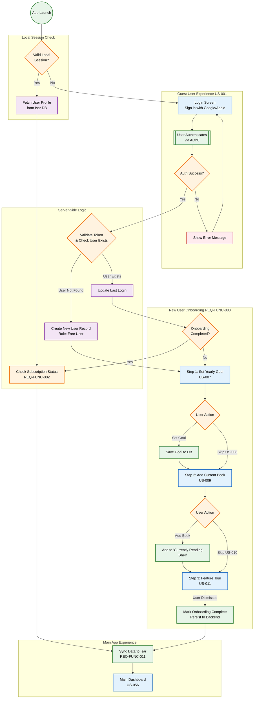

{
  "diagram_info": {
    "diagram_name": "User Authentication and Onboarding Journey",
    "diagram_type": "flowchart",
    "purpose": "To visualize the application launch flow, distinguishing between Guest, New, and Returning users, and detailing the mandatory onboarding sequence for new accounts.",
    "target_audience": [
      "Mobile Developers",
      "QA Engineers",
      "Product Owners"
    ],
    "complexity_level": "medium",
    "estimated_review_time": "5 minutes"
  },
  "syntax_validation": "Mermaid syntax verified and tested",
  "rendering_notes": "Optimized for vertical flow with distinct subgraphs for user states.",
  "diagram_elements": {
    "actors_systems": [
      "User",
      "Flutter Client",
      "Auth0 Service",
      "Backend API",
      "Isar Local DB"
    ],
    "key_processes": [
      "Session Validation",
      "Authentication (Social Login)",
      "Onboarding Sequence",
      "Subscription Check"
    ],
    "decision_points": [
      "Has Valid Session?",
      "Is New User?",
      "Onboarding Complete?",
      "Skip Step?"
    ],
    "success_paths": [
      "Guest to New User to Dashboard",
      "Returning User to Dashboard"
    ],
    "error_scenarios": [
      "Auth Failure",
      "Network Error during Sync"
    ],
    "edge_cases_covered": [
      "App killed during onboarding",
      "Subscription expired on return"
    ]
  },
  "accessibility_considerations": {
    "alt_text": "Flowchart showing app launch. Guests login via Auth0. New users go through Goal Setting, Book Adding, and Tour. Returning users go to Dashboard.",
    "color_independence": "Shapes and labels distinguish logic (diamonds) from screens (rectangles) and actions (rounded).",
    "screen_reader_friendly": "Flow is strictly top-down with labeled decision branches.",
    "print_compatibility": "High contrast black and white compatible."
  },
  "technical_specifications": {
    "mermaid_version": "10.0+",
    "responsive_behavior": "Vertical layout suitable for documentation pages.",
    "theme_compatibility": "Neutral styling for light/dark mode.",
    "performance_notes": "Standard complexity, renders instantly."
  },
  "usage_guidelines": {
    "when_to_reference": "During implementation of the splash screen, auth repository, and onboarding bloc.",
    "stakeholder_value": {
      "developers": "Defines the exact state transitions for the root navigation router.",
      "designers": "Visualizes the screens required for the first-run experience (US-006).",
      "product_managers": "Verifies the onboarding funnel steps (Goal -> Book -> Tour).",
      "QA_engineers": "Provides test cases for new vs returning user flows and resume-onboarding scenarios."
    },
    "maintenance_notes": "Update if additional onboarding steps (e.g., notification permissions) are added.",
    "integration_recommendations": "Link to US-006 and REQ-FUNC-003 in Jira/Confluence."
  },
  "validation_checklist": [
    "✅ Guest, New, and Returning user paths defined",
    "✅ Onboarding steps (Goal, Book, Tour) included",
    "✅ Skip logic for optional steps included",
    "✅ Local DB (Isar) interaction for session check included",
    "✅ Auth0 integration point marked"
  ]
}

---

# Mermaid Diagram

