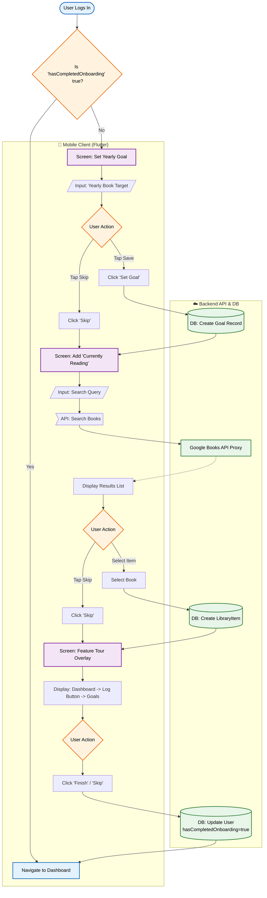

{
  "diagram_info": {
    "diagram_name": "User Onboarding & Activation Workflow",
    "diagram_type": "flowchart",
    "purpose": "To visualize the mandatory multi-step onboarding process for new users, detailing user interactions, decision points (skips), and backend persistence states.",
    "target_audience": [
      "frontend developers",
      "backend developers",
      "product designers",
      "QA engineers"
    ],
    "complexity_level": "medium",
    "estimated_review_time": "5 minutes"
  },
  "syntax_validation": "Mermaid syntax verified and tested",
  "rendering_notes": "Optimized for vertical flow with clear separation between User UI and Backend/Database operations",
  "diagram_elements": {
    "actors_systems": [
      "New User",
      "Mobile App (Flutter)",
      "Backend API",
      "Primary Database"
    ],
    "key_processes": [
      "Goal Setting",
      "Book Addition",
      "Feature Tour",
      "State Persistence"
    ],
    "decision_points": [
      "Skip Goal?",
      "Skip Book?",
      "Search Successful?",
      "Tour Completed?"
    ],
    "success_paths": [
      "Complete Profile Setup -> Dashboard"
    ],
    "error_scenarios": [
      "API Failure during save",
      "Search returns no results"
    ],
    "edge_cases_covered": [
      "User skips all steps",
      "App restart mid-onboarding"
    ]
  },
  "accessibility_considerations": {
    "alt_text": "Flowchart showing the new user onboarding journey from login to dashboard, including steps for setting goals, adding a book, and viewing the feature tour.",
    "color_independence": "Steps, Decisions, and Data actions are distinguished by shape and stroke style.",
    "screen_reader_friendly": "Nodes follow a logical top-down sequence matching the screen reader order.",
    "print_compatibility": "High contrast black and white compatible."
  },
  "technical_specifications": {
    "mermaid_version": "10.0+ compatible",
    "responsive_behavior": "Vertical layout fits standard documentation viewports",
    "theme_compatibility": "Neutral styling works in light/dark modes",
    "performance_notes": "Standard complexity, renders instantly"
  },
  "usage_guidelines": {
    "when_to_reference": "During development of the 'OnboardingScreen' widget and 'CompleteUserOnboardingCommand' backend handler.",
    "stakeholder_value": {
      "developers": "Defines exact API triggers and state transitions.",
      "designers": "Maps the user journey and optional paths.",
      "product_managers": "Visualizes the activation funnel steps.",
      "QA_engineers": "Provides a map for testing skip logic and persistence."
    },
    "maintenance_notes": "Update if new steps are added to the onboarding sequence.",
    "integration_recommendations": "Include in the PRD for 'First Time User Experience' (FTUE)."
  },
  "validation_checklist": [
    "✅ Happy path (Goal + Book + Tour) included",
    "✅ Skip paths for Goal and Book steps included",
    "✅ Backend state update (`hasCompletedOnboarding`) included",
    "✅ Transition to Dashboard clearly marked",
    "✅ API interactions identified"
  ]
}

---

# Mermaid Diagram

