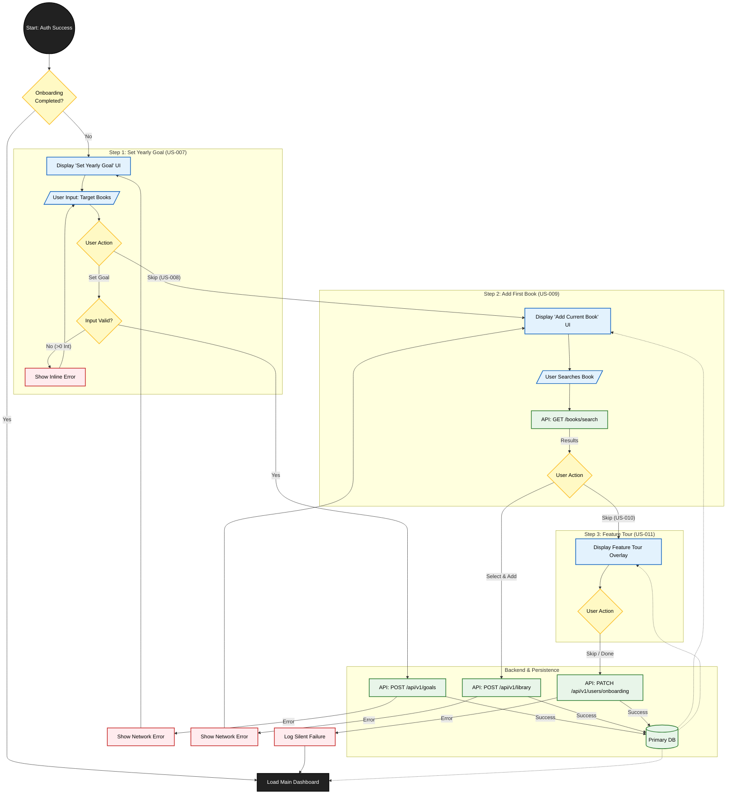

{
  "diagram_info": {
    "diagram_name": "User Onboarding and First-Time Setup Flow",
    "diagram_type": "flowchart",
    "purpose": "To visualize the mandatory multi-step onboarding sequence for new users, detailing the logical flow, data entry points, skip mechanisms, and backend persistence as defined in US-006 through US-011.",
    "target_audience": [
      "Mobile Developers",
      "Backend Developers",
      "UX Designers",
      "QA Engineers"
    ],
    "complexity_level": "medium",
    "estimated_review_time": "5-10 minutes"
  },
  "syntax_validation": "Mermaid syntax verified and tested",
  "rendering_notes": "Optimized for both light and dark themes with distinct color coding for UI steps, backend operations, and error states.",
  "diagram_elements": {
    "actors_systems": [
      "User",
      "Flutter Client",
      "Backend API",
      "Primary Database",
      "Google Books API"
    ],
    "key_processes": [
      "Goal Setting",
      "Book Search & Addition",
      "Feature Tour",
      "Onboarding Completion Persistence"
    ],
    "decision_points": [
      "Is Onboarding Complete?",
      "Skip Step?",
      "Input Validation",
      "API Success/Failure"
    ],
    "success_paths": [
      "Set Goal -> Add Book -> Complete Tour -> Dashboard",
      "Skip Goal -> Skip Book -> Skip Tour -> Dashboard"
    ],
    "error_scenarios": [
      "Invalid Goal Input",
      "Network Failure during Save",
      "Book Search Failure"
    ],
    "edge_cases_covered": [
      "User skips all optional steps",
      "Silent failure logging on tour completion"
    ]
  },
  "accessibility_considerations": {
    "alt_text": "Flowchart describing the new user onboarding process: Step 1 Set Goal, Step 2 Add Book, Step 3 Feature Tour, leading to the Dashboard.",
    "color_independence": "Shapes (rhombus for decisions, rectangles for process) denote function alongside color.",
    "screen_reader_friendly": "Nodes have descriptive text labels.",
    "print_compatibility": "High contrast borders ensure readability in grayscale."
  },
  "technical_specifications": {
    "mermaid_version": "10.0+ compatible",
    "responsive_behavior": "Vertical layout (TD) for better mobile scrolling readability.",
    "theme_compatibility": "Custom class definitions used to ensure consistency across themes.",
    "performance_notes": "Subgraphs used to logically group steps for faster cognitive processing."
  },
  "usage_guidelines": {
    "when_to_reference": "During implementation of US-006, US-007, US-008, US-009, US-010, US-011 and when testing the onboarding entry/exit logic.",
    "stakeholder_value": {
      "developers": "Defines the exact API endpoints triggered at each step and the expected error handling logic.",
      "designers": "Validates the skip/continue flow and visualizes the sequence of screens.",
      "product_managers": "Ensures all requirements from the Onboarding Epic are represented in the flow.",
      "qa_engineers": "Provides a map for E2E testing scenarios including happy paths and skip paths."
    },
    "maintenance_notes": "Update this diagram if the ordering of steps changes or if new mandatory steps (e.g., Notification Permissions) are added.",
    "integration_recommendations": "Embed in the Onboarding Epic documentation and link to the relevant UI mockups."
  },
  "validation_checklist": [
    "✅ Includes initial check for onboarding status",
    "✅ Represents logic for 'Set Goal' (US-007) and 'Skip Goal' (US-008)",
    "✅ Represents logic for 'Add Book' (US-009) and 'Skip Book' (US-010)",
    "✅ Represents Feature Tour flow (US-011)",
    "✅ Details backend persistence calls",
    "✅ Handles API error scenarios"
  ]
}

---

# Mermaid Diagram

