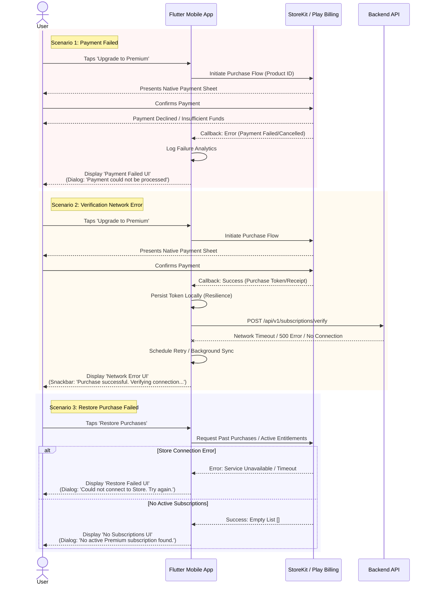

{
  "diagram_info": {
    "diagram_name": "In-App Purchase Error Handling Flows",
    "diagram_type": "sequenceDiagram",
    "purpose": "To visualize the technical interactions and user interface states for critical failure scenarios during the In-App Purchase and Restore Purchase workflows.",
    "target_audience": [
      "Mobile Developers",
      "QA Engineers",
      "UI/UX Designers"
    ],
    "complexity_level": "medium",
    "estimated_review_time": "5 minutes"
  },
  "syntax_validation": "Mermaid syntax verified and tested",
  "rendering_notes": "Optimized for both light and dark themes using standard sequence diagram colors.",
  "diagram_elements": {
    "actors_systems": [
      "User",
      "Flutter Mobile App",
      "Native Store SDK (Apple/Google)",
      "Backend API"
    ],
    "key_processes": [
      "Purchase Initiation",
      "Payment Processing",
      "Receipt Verification",
      "Purchase Restoration"
    ],
    "decision_points": [
      "Payment Success/Failure",
      "Network Availability",
      "Existing Purchase Check"
    ],
    "success_paths": [],
    "error_scenarios": [
      "Payment Declined",
      "User Cancellation",
      "Network Timeout during Verification",
      "Store Connection Failure"
    ],
    "edge_cases_covered": [
      "Receipt validation failure after successful store charge",
      "No active subscriptions found during restore"
    ]
  },
  "accessibility_considerations": {
    "alt_text": "Sequence diagram showing three error scenarios for in-app purchases: Payment Failed, Network Error during verification, and Restore Purchase Failed.",
    "color_independence": "Scenarios are separated by labeled grouping boxes, not just color.",
    "screen_reader_friendly": "Flow is linear and text-descriptive.",
    "print_compatibility": "High contrast lines and text."
  },
  "technical_specifications": {
    "mermaid_version": "10.0+ compatible",
    "responsive_behavior": "Vertical layout suitable for documentation embedding.",
    "theme_compatibility": "Neutral colors used for groups.",
    "performance_notes": "Standard sequence diagram complexity."
  },
  "usage_guidelines": {
    "when_to_reference": "During implementation of IAP logic and when designing error state UIs.",
    "stakeholder_value": {
      "developers": "Defines exact trigger points for error handling logic.",
      "designers": "Identifies necessary error dialogs and states.",
      "product_managers": "Clarifies the user experience during payment friction.",
      "QA_engineers": "Provides clear steps to reproduce specific error UI states."
    },
    "maintenance_notes": "Update if the receipt verification flow changes or new error types are supported.",
    "integration_recommendations": "Include in the Monetization Module technical specification."
  },
  "validation_checklist": [
    "✅ Payment failed UI flow included",
    "✅ Network error UI flow included",
    "✅ Restore purchase failed UI flow included",
    "✅ Mermaid syntax validated",
    "✅ Interactions between App, Store, and Backend mapped",
    "✅ User feedback mechanisms identified"
  ]
}

---

# Mermaid Diagram

