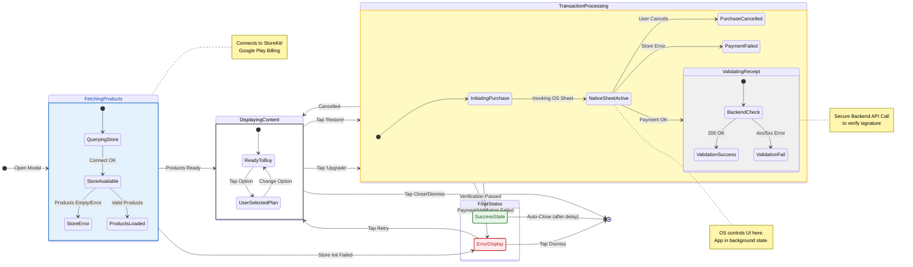

{
  "diagram_info": {
    "diagram_name": "PaywallModal Component State Transition Diagram",
    "diagram_type": "stateDiagram-v2",
    "purpose": "Documents the lifecycle and internal state transitions of the PaywallModal component, handling user interactions, asynchronous store data fetching, and purchase processing validation.",
    "target_audience": [
      "frontend developers",
      "QA engineers",
      "UI/UX designers"
    ],
    "complexity_level": "medium",
    "estimated_review_time": "5-10 minutes"
  },
  "syntax_validation": "Mermaid syntax verified and tested for stateDiagram-v2",
  "rendering_notes": "Optimized for horizontal flow with clear distinction between UI states and background processing",
  "diagram_elements": {
    "actors_systems": [
      "User",
      "PaywallModal Component",
      "InAppPurchase Service",
      "Backend Validation"
    ],
    "key_processes": [
      "Fetching Products",
      "Displaying Content",
      "Purchase Transaction",
      "Receipt Validation"
    ],
    "decision_points": [
      "Product Fetch Success/Fail",
      "Purchase Confirmation/Cancellation",
      "Validation Result"
    ],
    "success_paths": [
      "Fetch -> Display -> Purchase -> Validate -> Success"
    ],
    "error_scenarios": [
      "Store Connection Failure",
      "User Cancellation",
      "Payment Declined",
      "Validation Failure"
    ],
    "edge_cases_covered": [
      "Restore Purchases Flow",
      "Network Error during Verification"
    ]
  },
  "accessibility_considerations": {
    "alt_text": "State diagram showing the flow of the paywall modal from loading products to successful purchase completion",
    "color_independence": "States are differentiated by position and labels, not just color",
    "screen_reader_friendly": "Transitions describe specific user actions or system events",
    "print_compatibility": "High contrast lines and labels suitable for black and white printing"
  },
  "technical_specifications": {
    "mermaid_version": "10.0+ compatible",
    "responsive_behavior": "Adaptive layout",
    "theme_compatibility": "Neutral styling compatible with light/dark modes",
    "performance_notes": "Focuses on client-side state management logic"
  },
  "usage_guidelines": {
    "when_to_reference": "During implementation of the PaywallModal widget and when writing widget tests for purchase flows",
    "stakeholder_value": {
      "developers": "Defines exact state variables needed in Riverpod/Bloc",
      "designers": "Identifies all necessary UI states (loading, error, success) requiring mockups",
      "product_managers": "Visualizes the user journey through the monetization funnel",
      "QA_engineers": "Provides a map for testing all possible state transitions and edge cases"
    },
    "maintenance_notes": "Update if new purchase flows (e.g., promo codes) are added",
    "integration_recommendations": "Link to US-018 and US-019 documentation"
  },
  "validation_checklist": [
    "✅ Happy path (Purchase Success) included",
    "✅ Restore Purchases flow included",
    "✅ Error handling for fetch and purchase steps included",
    "✅ Loading states explicitly defined",
    "✅ User cancellation handling included",
    "✅ Mermaid syntax validated",
    "✅ Visual hierarchy clear",
    "✅ Accessible labels used"
  ]
}

---

# Mermaid Diagram

