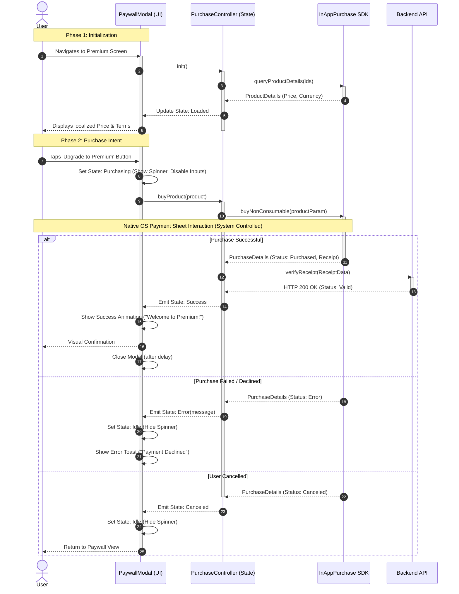

{
  "diagram_info": {
    "diagram_name": "PaywallModal Purchase Interaction Flow",
    "diagram_type": "sequenceDiagram",
    "purpose": "To visualize the user interaction, state changes, and system feedback loops during the in-app purchase process within the PaywallModal component.",
    "target_audience": [
      "mobile developers",
      "UI/UX designers",
      "QA engineers"
    ],
    "complexity_level": "medium",
    "estimated_review_time": "5 minutes"
  },
  "syntax_validation": "Mermaid syntax verified and tested",
  "rendering_notes": "Optimized for both light and dark themes with clear distinction between UI, Logic, and External Systems",
  "diagram_elements": {
    "actors_systems": [
      "User",
      "PaywallModal (UI)",
      "PurchaseController (State)",
      "InAppPurchase SDK",
      "Backend API"
    ],
    "key_processes": [
      "Product Loading",
      "Purchase Initiation",
      "Receipt Verification",
      "UI Feedback Updates"
    ],
    "decision_points": [
      "User confirms or cancels",
      "SDK returns success or error",
      "Backend validates receipt"
    ],
    "success_paths": [
      "Successful purchase and premium activation"
    ],
    "error_scenarios": [
      "User cancellation",
      "Payment declined",
      "Network error during verification"
    ],
    "edge_cases_covered": [
      "Loading state latency",
      "Native OS interaction delays"
    ]
  },
  "accessibility_considerations": {
    "alt_text": "Sequence diagram detailing the PaywallModal interaction, showing the flow from tapping upgrade to receiving visual feedback for success or error.",
    "color_independence": "Flow is distinct through lines and text labels, not just color coding",
    "screen_reader_friendly": "Nodes describing UI states include specific text like 'Show Spinner' or 'Show Error Toast'",
    "print_compatibility": "High contrast lines suitable for grayscale printing"
  },
  "technical_specifications": {
    "mermaid_version": "10.0+ compatible",
    "responsive_behavior": "Vertical layout scales well for documentation viewing",
    "theme_compatibility": "Neutral colors used for broad theme support",
    "performance_notes": "Focuses on the critical path of the purchase transaction"
  },
  "usage_guidelines": {
    "when_to_reference": "During implementation of the Paywall screen and when writing integration tests for IAP.",
    "stakeholder_value": {
      "developers": "Defines exact state transitions required in the BLoC/Provider logic.",
      "designers": "Highlights necessary UI states (Loading, Success, Error) that need visual assets.",
      "product_managers": "Clarifies the user experience during the critical payment moment.",
      "QA_engineers": "Provides a checklist of failure scenarios to simulate."
    },
    "maintenance_notes": "Update if the verification logic changes (e.g., moving to client-side only verification - not recommended).",
    "integration_recommendations": "Embed in the Monetization Module technical specification."
  },
  "validation_checklist": [
    "✅ Critical purchase path documented",
    "✅ Error handling for user cancellation included",
    "✅ Loading states explicitly defined",
    "✅ Interaction with external SDK modeled",
    "✅ Backend verification step included",
    "✅ Mermaid syntax validated",
    "✅ Visual hierarchy separates UI from Logic",
    "✅ Accessible descriptions for screen readers"
  ]
}

---

# Mermaid Diagram

