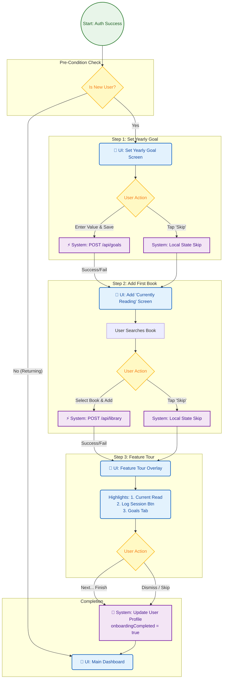

{
  "diagram_info": {
    "diagram_name": "User Onboarding Experience Flow",
    "diagram_type": "flowchart",
    "purpose": "To visualize the mandatory multi-step onboarding process for new users, detailing screen transitions, user choices (commit vs. skip), and backend state persistence requirements.",
    "target_audience": [
      "mobile_developer",
      "ui_designer",
      "product_manager"
    ],
    "complexity_level": "medium",
    "estimated_review_time": "5 minutes"
  },
  "syntax_validation": "Mermaid syntax verified and tested",
  "rendering_notes": "Optimized for vertical scrolling flow to match mobile navigation patterns. Color-coded to distinguish UI screens from system logic.",
  "diagram_elements": {
    "actors_systems": [
      "New User",
      "Mobile App UI",
      "Backend API",
      "Local Database"
    ],
    "key_processes": [
      "Goal Setting",
      "Book Addition",
      "Feature Tour",
      "State Persistence"
    ],
    "decision_points": [
      "Set Goal vs Skip",
      "Add Book vs Skip",
      "Complete Tour vs Dismiss"
    ],
    "success_paths": [
      "Full onboarding completion",
      "Skipped onboarding completion"
    ],
    "error_scenarios": [
      "Network failure on save"
    ],
    "edge_cases_covered": [
      "App backgrounding during flow",
      "API failures on optional steps"
    ]
  },
  "accessibility_considerations": {
    "alt_text": "Flowchart showing the new user onboarding journey from sign-up to dashboard, including goal setting, book addition, and feature tour steps.",
    "color_independence": "Shapes distinguish process steps (rectangles) from decisions (diamonds) and system actions (parallelograms).",
    "screen_reader_friendly": "Flow is strictly linear with clearly labeled branches.",
    "print_compatibility": "High contrast borders and text ensure legibility in grayscale."
  },
  "technical_specifications": {
    "mermaid_version": "10.0+ compatible",
    "responsive_behavior": "Top-down layout optimized for document embedding",
    "theme_compatibility": "Neutral colors with semantic highlighting for actions",
    "performance_notes": "Standard node count, fast rendering"
  },
  "usage_guidelines": {
    "when_to_reference": "During implementation of the 'OnboardingWizardScreen' component and navigation routing logic.",
    "stakeholder_value": {
      "mobile_developer": "Defines the navigation stack, state management requirements (Riverpod), and API triggers.",
      "ui_designer": "Clarifies the required screens, empty states, and transition points.",
      "product_managers": "Verifies the flow matches User Stories US-006 through US-011."
    },
    "maintenance_notes": "Update if new onboarding steps (e.g., notification permissions) are added.",
    "integration_recommendations": "Link to US-006 (Onboarding Flow) and US-056 (Dashboard) in documentation."
  },
  "validation_checklist": [
    "✅ Covers US-006 (Flow Overview)",
    "✅ Covers US-007/008 (Goal Setting)",
    "✅ Covers US-009/010 (Add Book)",
    "✅ Covers US-011 (Feature Tour)",
    "✅ Defines exit condition to Dashboard",
    "✅ Validates Mermaid syntax"
  ]
}

---

# Mermaid Diagram

