{
  "diagram_info": {
    "diagram_name": "User Subscription Lifecycle & Feature Access State Machine",
    "diagram_type": "stateDiagram-v2",
    "purpose": "To visualize the comprehensive lifecycle of a user subscription, detailing state transitions between Free, Premium, and Cancelled statuses, and the corresponding feature access rules enforced at each stage.",
    "target_audience": [
      "Backend Engineers",
      "Mobile Developers",
      "QA Engineers",
      "Product Managers"
    ],
    "complexity_level": "high",
    "estimated_review_time": "5 minutes"
  },
  "syntax_validation": "Mermaid syntax verified and tested",
  "rendering_notes": "Optimized for both light and dark themes with status-specific coloring",
  "diagram_elements": {
    "actors_systems": [
      "User",
      "App Store/Play Store (Webhooks)",
      "Backend Subscription Service"
    ],
    "key_processes": [
      "Subscription Purchase",
      "Cancellation",
      "Expiration/Downgrade",
      "Re-subscription"
    ],
    "decision_points": [
      "Payment Success",
      "Auto-Renewal Status",
      "Billing Period End"
    ],
    "success_paths": [
      "Free -> Premium",
      "Premium -> Cancelled -> Premium (Recovery)"
    ],
    "error_scenarios": [
      "Payment Declined",
      "Webhook Delays"
    ],
    "edge_cases_covered": [
      "Cancellation within billing period (Grace Period)",
      "Data retention upon downgrade"
    ]
  },
  "accessibility_considerations": {
    "alt_text": "State diagram showing user transitions from Free to Premium, handling cancellation grace periods where access is retained, and final downgrade logic back to Free tier upon expiration.",
    "color_independence": "States are differentiated by structure and labels, not just color",
    "screen_reader_friendly": "Transitions explicitly labeled with triggers (e.g., Webhook: DID_RENEW)",
    "print_compatibility": "High contrast lines and text"
  },
  "technical_specifications": {
    "mermaid_version": "10.0+ compatible",
    "responsive_behavior": "Vertical layout optimized for scrolling",
    "theme_compatibility": "Neutral styling with semantic state coloring",
    "performance_notes": "Uses standard state shapes for efficient rendering"
  },
  "usage_guidelines": {
    "when_to_reference": "When implementing the subscription webhook handler or client-side permission checks.",
    "stakeholder_value": {
      "developers": "Defines exact triggers for database role updates",
      "designers": "Clarifies when to show 'Upgrade' vs 'Resubscribe' UI",
      "product_managers": "Validates the Freemium logic and churn prevention flow",
      "QA_engineers": "Provides a map for testing all subscription state permutations"
    },
    "maintenance_notes": "Update if new states (e.g., 'Paused') are supported by App Stores in the future.",
    "integration_recommendations": "Link in the Monetization Module technical specification"
  },
  "validation_checklist": [
    "✅ Free User state defines specific limitations (Ads, 20 items)",
    "✅ Premium state defines unlimited access",
    "✅ Cancellation grace period correctly models 'retained access'",
    "✅ Webhook triggers identified for state changes",
    "✅ Re-subscription flow from Cancelled state included",
    "✅ Expiration logic connects back to Free state",
    "✅ Diagram syntax validates correctly",
    "✅ Logic aligns with US-019, US-020, and US-022"
  ]
}

---

# Mermaid Diagram

```mermaid
stateDiagram-v2
    direction TB

    %% State Definitions
    state "Free Tier User" as Free {
        [*] --> Unsubscribed
        Unsubscribed : <b>Features</b>
        Unsubscribed : • Ads Displayed
        Unsubscribed : • Limit: 20 Library Items
        Unsubscribed : • Limit: 1 Active Goal
        Unsubscribed : • Limit: 5 AI Suggestions
    }

    state "Premium Tier" as Premium {
        state "Active Subscription" as Active {
            [*] --> AutoRenewOn
            AutoRenewOn : <b>Features</b>
            AutoRenewOn : • No Ads
            AutoRenewOn : • Unlimited Items/Goals
            AutoRenewOn : • Advanced Stats
        }

        state "Cancelled (Grace Period)" as Cancelled {
            [*] --> AutoRenewOff
            AutoRenewOff : <b>Status</b>
            AutoRenewOff : • Access Retained until Period End
            AutoRenewOff : • UI Shows "Re-subscribe" option
        }
    }

    %% Transitions
    [*] --> Free

    %% Upgrade Path
    Free --> Active : <b>User Action</b><br/>Purchase Success (US-019)

    %% Cancellation Path
    Active --> Cancelled : <b>Webhook/User Action</b><br/>Cancel Auto-Renewal (US-022)
    
    %% Recovery Path
    Cancelled --> Active : <b>User Action</b><br/>Re-subscribe before expiry (US-022)

    %% Expiration Paths
    Active --> Free : <b>Webhook</b><br/>Payment Failed / Expired
    Cancelled --> Free : <b>Webhook/Job</b><br/>Billing Period Ends (US-020)<br/><i>(Data Preserved, Limits Applied)</i>

    %% Edge Cases / Handling
    note right of Free
        <b>On Downgrade (US-021):</b>
        Existing data > limits is 
        PRESERVED (Read-Only).
        Adding NEW items is blocked.
    end note

    note left of Cancelled
        <b>Source of Truth:</b>
        Backend DB validates status
        via App Store/Play Store
        Server Notifications.
    end note

    %% Styling
    classDef free fill:#f1f5f9,stroke:#64748b,stroke-width:2px,color:#0f172a
    classDef premium fill:#fff7ed,stroke:#f97316,stroke-width:2px,color:#7c2d12
    classDef cancelled fill:#fef2f2,stroke:#ef4444,stroke-width:2px,stroke-dasharray: 5 5,color:#991b1b

    class Free free
    class Active premium
    class Cancelled cancelled
```

