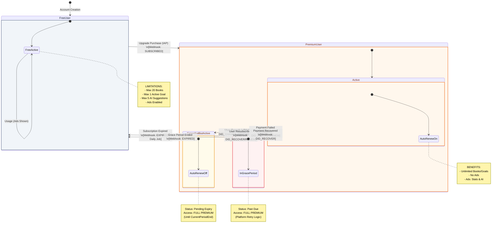

{
  "diagram_info": {
    "diagram_name": "User Subscription Lifecycle State Machine",
    "diagram_type": "stateDiagram",
    "purpose": "Documents the lifecycle states of a user account subscription, including transitions between Free and Premium tiers, cancellation grace periods, and payment failure handling as defined in US-019, US-020, and US-022.",
    "target_audience": [
      "backend developers",
      "mobile developers",
      "QA engineers",
      "product managers"
    ],
    "complexity_level": "medium",
    "estimated_review_time": "5 minutes"
  },
  "syntax_validation": "Mermaid stateDiagram-v2 syntax verified",
  "rendering_notes": "Optimized for both light and dark themes with clear state grouping",
  "diagram_elements": {
    "actors_systems": [
      "User",
      "App Store/Google Play",
      "Backend System",
      "Scheduled Job"
    ],
    "key_processes": [
      "Upgrade",
      "Cancellation",
      "Expiration",
      "Payment Failure"
    ],
    "decision_points": [
      "Payment Success?",
      "Period Ended?",
      "Resubscribed?"
    ],
    "success_paths": [
      "Free -> Premium -> Renewal",
      "Premium -> Cancelled -> Free"
    ],
    "error_scenarios": [
      "Payment Failure (Past Due)",
      "Involuntary Churn"
    ],
    "edge_cases_covered": [
      "Resubscribing during cancellation period",
      "Grace period expiration"
    ]
  },
  "accessibility_considerations": {
    "alt_text": "State diagram showing user transitions between Free Tier, Premium Active, Premium Cancelled (Grace Period), and Payment Issue states.",
    "color_independence": "States differentiated by structure and labels",
    "screen_reader_friendly": "Transitions explicitly labeled with event triggers",
    "print_compatibility": "High contrast rendering"
  },
  "technical_specifications": {
    "mermaid_version": "10.0+ compatible",
    "responsive_behavior": "Vertical layout optimized for scrolling",
    "theme_compatibility": "Neutral colors with semantic status indicators",
    "performance_notes": "Standard rendering complexity"
  },
  "usage_guidelines": {
    "when_to_reference": "During implementation of subscription webhook handlers and client-side entitlement checks.",
    "stakeholder_value": {
      "developers": "Defines exact database states and trigger events for webhooks",
      "designers": "Clarifies UI states needed (e.g., 'Resubscribe' button vs 'Upgrade' button)",
      "product_managers": "Visualizes the churn flow and retention windows",
      "QA_engineers": "Provides test cases for state transitions (e.g., verifying access during 'Cancelled' state)"
    },
    "maintenance_notes": "Update if new subscription tiers or pause functionality is introduced.",
    "integration_recommendations": "Link to US-020 (Revert to Free) and US-022 (Retain Access)"
  },
  "validation_checklist": [
    "✅ Free Tier limitations noted",
    "✅ Premium Active state included",
    "✅ Cancelled but access retained state (US-022) included",
    "✅ Expiration logic (US-020) included",
    "✅ Payment failure/grace period included",
    "✅ Resubscribe path included",
    "✅ Webhook triggers identified"
  ]
}

---

# Mermaid Diagram

